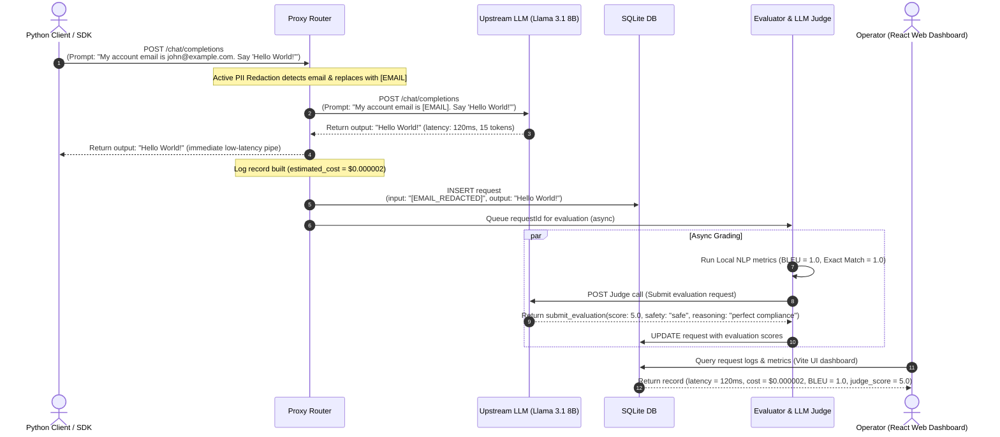
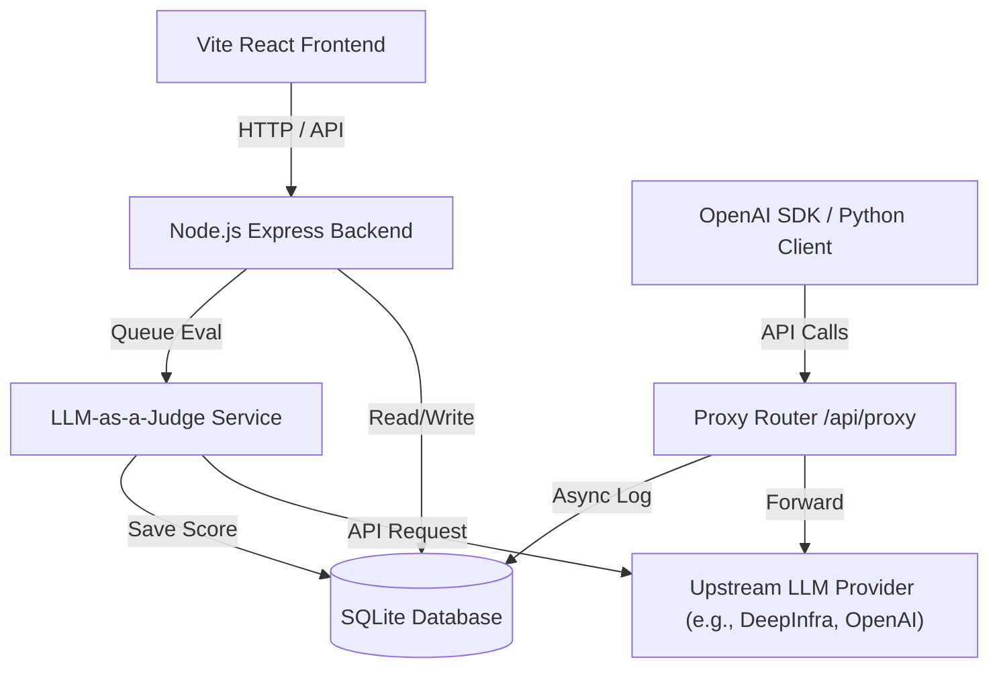
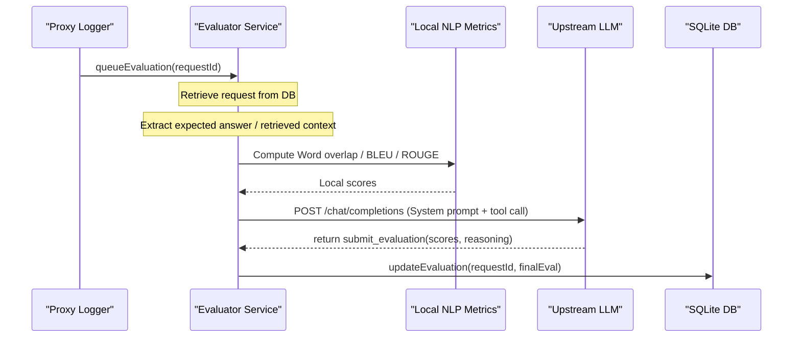

# InfraSight (InfraSight) — High-Level Overview

InfraSight is a self-hosted, lightweight observability platform and transparent proxy router designed to trace, monitor, debug, and evaluate LLM request pipelines and multi-agent workflows. It hooks directly into any OpenAI-compatible API client, stores trace data locally inside an SQLite database, and presents real-time insights through a premium dark-themed dashboard.

---

## 🔄 Complete Request Lifecycle & Observability Flow

Here is the step-by-step flow of how a single prompt containing sensitive data (e.g. a "Hello World" request containing an email address) flows through the entire system, gets sanitized, logged, evaluated, and rendered:



1. **Client Sends Request**: Your Python script triggers a request to the proxy:
   * **Payload**: `{"model": "meta-llama/Llama-3.1-8B-Instruct", "messages": [{"role": "user", "content": "My account email is john@example.com. Say 'Hello World!'"}]}`
2. **Proxy In-Transit Sanitization**:
   * The active PII filter detects `john@example.com` and rewrites the content.
   * **Payload forwarded to LLM**: `"My account email is [EMAIL]. Say 'Hello World!'"`
3. **Upstream LLM Generates Response**:
   * **Upstream Output**: `"Hello World!"`
4. **Proxy Saves Telemetry**: The proxy returns `"Hello World!"` to the client app in `120ms` and writes to the SQLite database:
   * `input_messages`: `[{"role": "user", "content": "My account email is [EMAIL_REDACTED]. Say 'Hello World!'"}]`
   * `output_message`: `{"role": "assistant", "content": "Hello World!"}`
   * `estimated_cost`: `$0.000002` (derived from token counts)
5. **Background Evaluator Recalculates**:
   * **Local NLP checks** (if metadata matches expected ground truth *"Hello World!"*): Exact Match = `1.0`, BLEU = `1.0`.
   * **LLM-as-a-Judge**: Evaluates that the model followed user instructions perfectly (`instruction_following: 5.0`) and confirms the safety status (`safety: "safe"`).
6. **Dashboard Renders Updated Metrics**: The settings panel and overview cards automatically query the database and refresh to reflect the updated logs, costs, and high-quality evaluation scores.

---

## 🚀 Key Value Propositions

* **Zero-SaaS Privacy**: Everything runs locally on your own infrastructure (or in a lightweight Docker container). Prompt payloads, PII data, and cost metrics never leave your secure boundaries.
* **Drop-in Integration**: Acting as a transparent proxy layer, it conforms exactly to the OpenAI completions endpoint schema. No new proprietary libraries are needed—just redirect your client SDK's `base_url` to the proxy.
* **Developer-Friendly Stack**: Built simply and cleanly with **React (Vite)** on the frontend, **Node.js (Express)** on the backend, and **SQLite** as a robust, single-file database.
* **Active Proxy Guardrails**: Features real-time keyword blocklists and active in-transit PII redaction to intercept and scrub sensitive data *before* it gets forwarded to upstream LLMs.

---

## ⚙️ Core Telemetry & Observability Pillars

### 1. Tracing Requests & Logs
* **How it works**: The Transparent Proxy Router (`server/proxy/index.js`) intercepts all completions. It maps individual completions into multi-turn threads using a `conversation_id`.
* **Where to see it**: 
  * The **Logs** page (`client/src/pages/Logs.jsx`) lists all request entries.
  * The **Conversations** tab shows grouped, turn-by-turn chat replays.

### 2. Monitoring Latency and Costs
* **How it works**:
  * **Latency**: The proxy captures the high-resolution execution time of the upstream fetch request and records it as `latency_ms`.
  * **Costs**: The DB controller calculates the cost dynamically based on the specific model's configured prompt/completion prices per million tokens (stored in the `models` registry).
* **Where to see it**:
  * The **Dashboard** (`client/src/pages/Dashboard.jsx`) and **Analytics** (`client/src/pages/Analytics.jsx`) render daily metrics, time-series charts (aggregate tokens, daily costs), and latency distribution statistics (average, p50, p95, p99 percentiles).

### 3. Debugging Agent Workflows
* **How it works**: 
  * **Span Hierarchies**: Supports standard OpenTelemetry trace propagation headers (`X-Trace-Id`, `X-Span-Id`, `X-Parent-Span-Id`, `X-Span-Type`). It reconstructs nested agent step executions (e.g. `agent` -> `chain` -> `tool` -> `llm`).
  * **Human-in-the-Loop (HITL)**: Supports intercepting sensitive actions (like transactions) by holding the request state in `awaiting_approval` status, pausing client execution until approved/rejected in settings.
* **Where to see it**:
  * The **Trace Explorer** inside the **Logs** tab maps the visual tree of agent calls, tool execution payloads, and spans.

### 4. Evaluating System Performance (AI Evaluator)
* **How it works**: The background evaluation worker (`server/services/evaluator.js`) runs a hybrid evaluation pipeline:
  * **Local NLP Metrics**: Automatically evaluates text responses against ground truth datasets (Exact Match, BLEU-4, ROUGE-1/2/L, F1-Score) and RAG document retrievals (Precision, Recall, MRR) locally.
  * **LLM-as-a-Judge**: Leverages a judge model to classify tasks and rate them on strict quality metrics (such as `instruction_following` and `conciseness`) alongside checking safety ratings (`safe`, `flagged`, `unsafe`).
* **Where to see it**:
  * The **Evaluation** panel inside any request log detail page renders the quality scores, safety audit logs, and judge reasoning.

---

## ⚖️ How InfraSight Differs from Online Alternatives (e.g., LangSmith, Helicone, LangFuse)

Unlike popular online SaaS observability platforms, InfraSight introduces several distinct advantages:

1. **Active In-Transit Redaction vs. Post-Hoc Masking**: Other tools log data *after* it leaves your system or run masking post-hoc on their cloud databases. InfraSight actively intercepts and redacts PII *before* it leaves your server boundaries.
2. **Native Human-in-the-Loop (HITL) Routing**: InfraSight includes built-in approval loops directly at the proxy layer, pausing client execution for sensitive steps and letting operators review/approve them from the web dashboard.
3. **Local Hybrid Evaluations**: Rather than relying entirely on slow, expensive cloud evaluations, InfraSight calculates strict NLP metrics (BLEU, ROUGE, Exact Match) locally on your hardware, combining them asynchronously with lightweight LLM-as-a-Judge safety auditing.
4. **Zero Account Setup & SaaS Lock-in**: Conforms exactly to the OpenAI API standard. You do not need to create third-party accounts, register keys with external cloud tools, or install heavy proprietary client wrappers.

---

## 1. System Architecture & Component Mapping

InfraSight is structured as a decoupled, transparent observability wrapper. It intercepts standard OpenAI-compatible requests, logs metadata, calculates costs and performance metrics, runs background evaluations, and renders real-time dashboard analytics.



### Directory & Key File Manifest

| Component | Target File | Purpose |
|---|---|---|
| **Server Entry** | [server/index.js](./server/index.js) | Main startup, CORS setups, global optional Basic Auth middleware, static file serving, and `/api/health` configuration. |
| **Proxy Router** | [server/proxy/index.js](./server/proxy/index.js) | Intercepts, buffers, pipes, and analyzes chat request/response streams. Handles fallback token estimates, custom pricing cost lookups, and PII masking. |
| **DB Controller** | [server/db/index.js](./server/db/index.js) | Initial migrations, statement precompilations, transactions, analytical aggregations, and CRUD execution. |
| **DB Schema** | [server/db/schema.sql](./server/db/schema.sql) | DDL scripts defining tables, indexing, and cascade delete constraints. |
| **Log Seeder** | [server/db/seed-mock-logs.js](./server/db/seed-mock-logs.js) | Script populating 30 days of mock traces, multi-turn conversations, RAG metrics, and scores. |
| **Model Seeder** | [server/db/seed-models.js](./server/db/seed-models.js) | Default upstream pricing list covering prompt/completion tokens cost per million. |
| **Evaluation Engine** | [server/services/evaluator.js](./server/services/evaluator.js) | Asynchronous queue driver for LLM-as-a-Judge grading. Detects tasks and prompts judge model. |
| **Local Metrics** | [server/utils/nlp-eval.js](./server/utils/nlp-eval.js) | Computes Exact Match, F1, BLEU, ROUGE-1/2/L, and Precision/Recall/MRR algorithms. |
| **PII Redaction** | [server/utils/pii.js](./server/utils/pii.js) | Regular expressions engine designed to detect and mask emails, credit card patterns, and phone numbers. |
| **Client Router** | [client/src/App.jsx](./client/src/App.jsx) | Handles routing, visual theme wraps, and SPA navigation layout containers. |
| **Global Style Sheet**| [client/src/index.css](./client/src/index.css) | Custom styling system introducing dark theme tokens, cards styling, and layout scrollbars. |
| **Python SDK Client** | [tests/infrasight.py](./tests/infrasight.py) | Standalone client wrapper library designed for zero-dependency Python completions and traces instrumentation. |
| **Unified Test Suite**| [tests/run_all.py](./tests/run_all.py) | Comprehensive test runner executing all telemetry, guardrail, and HITL simulation suites. |
| **Integration Suite** | [tests/test_integration.py](./tests/test_integration.py) | Validates basic completions, thread-level conversations, specialized task categorization, and nested agent span traces. |
| **Guardrails Suite**  | [tests/test_guardrails.py](./tests/test_guardrails.py) | Validates proxy-level keyword blocking, active in-transit PII redaction, and judge-level safety rating ingestion. |
| **HITL Simulation**   | [tests/test_hitl.py](./tests/test_hitl.py) | Simulates Human-in-the-Loop workflows in automated and interactive dashboard-approved modes. |
| **Stress testing**    | [tests/test_stress.py](./tests/test_stress.py) | Evaluates proxy request concurrency and handling under high parallel client loads. |
| **SDK Unit Test**     | [tests/test_sdk.py](./tests/test_sdk.py) | Validates standalone functionality of the zero-dependency Python SDK client. |

---

## 2. Database Schema & Index Design

The SQLite database (`infrasight.db`) relies on five primary tables to store state. Foreign keys are enforced explicitly (`PRAGMA foreign_keys = ON;`).

### Schema Table Summary
* **`requests`**: Logs detailed input/output payloads, parameters, latencies, cost estimates, human reviews, quality grades, and OpenTelemetry spans.
* **`conversations`**: Aggregates grouped request records to represent multi-turn developer chat sessions.
* **`models`**: Tracks upstream model specifications and pricing structures per million prompt/completion tokens.
* **`prompts`**: Manages the prompt template registry, offering versioning controls and variable substitution trackers.
* **`daily_stats`**: Stores pre-aggregated daily summaries (cost, volume, latency, errors) for scaling queries.

### Table: `requests`
Logs individual API payloads, parameters, latency, cost, evaluations, and OpenTelemetry trace spans.
```sql
CREATE TABLE IF NOT EXISTS requests (
    id TEXT PRIMARY KEY,
    conversation_id TEXT,
    model TEXT NOT NULL,
    provider TEXT DEFAULT 'deepinfra',
    input_messages TEXT NOT NULL,       -- JSON array of {role, content}
    output_message TEXT,                -- JSON {role, content}
    prompt_tokens INTEGER DEFAULT 0,
    completion_tokens INTEGER DEFAULT 0,
    total_tokens INTEGER DEFAULT 0,
    estimated_cost REAL DEFAULT 0,
    latency_ms INTEGER DEFAULT 0,
    status TEXT DEFAULT 'success',      -- 'success', 'error', 'streaming'
    error_message TEXT,
    temperature REAL,
    max_tokens INTEGER,
    top_p REAL,
    frequency_penalty REAL,
    presence_penalty REAL,
    user_id TEXT,
    metadata TEXT,                      -- JSON object storing context, ground_truth, etc.
    tags TEXT,                          -- JSON array of custom label tags
    stream INTEGER DEFAULT 0,           -- 1 = true, 0 = false
    raw_request TEXT,                   -- JSON request body payload
    raw_response TEXT,                  -- JSON response payload
    feedback TEXT,                      -- JSON {score: 1|-1, comment: string}
    evaluation TEXT,                    -- JSON {score: number, reasoning: string, task_type: string, ...}
    trace_id TEXT,                      -- Trace identifier
    span_id TEXT,                       -- Span identifier
    parent_span_id TEXT,                -- Parent span identifier
    span_name TEXT,                     -- Span name label
    span_type TEXT,                     -- 'llm', 'tool', 'chain', 'agent'
    created_at TEXT DEFAULT (datetime('now')),
    FOREIGN KEY (conversation_id) REFERENCES conversations(id) ON DELETE SET NULL
);
```

### Table: `conversations`
Groups requests into multi-turn chat sessions for tracking conversational history.
```sql
CREATE TABLE IF NOT EXISTS conversations (
    id TEXT PRIMARY KEY,
    title TEXT,
    total_messages INTEGER DEFAULT 0,
    total_tokens INTEGER DEFAULT 0,
    total_cost REAL DEFAULT 0,
    first_message_at TEXT,
    last_message_at TEXT,
    created_at TEXT DEFAULT (datetime('now'))
);
```

### Table: `models`
Stores model identifiers and upstream pricing specifications for cost calculation.
```sql
CREATE TABLE IF NOT EXISTS models (
    id TEXT PRIMARY KEY,                    -- Model identifier, e.g., 'meta-llama/Llama-3.3-70B-Instruct'
    name TEXT NOT NULL,                     -- Descriptive name
    display_name TEXT,                      -- User-facing display name
    provider TEXT DEFAULT 'deepinfra',      -- Upstream provider name
    input_cost_per_million REAL DEFAULT 0,  -- Cost in USD per 1M prompt tokens
    output_cost_per_million REAL DEFAULT 0, -- Cost in USD per 1M completion tokens
    context_window INTEGER,                 -- Context length window limit
    created_at TEXT DEFAULT (datetime('now'))
);
```

### Table: `prompts`
Manages the prompt registry, offering versioning controls and variable substitution trackers.
```sql
CREATE TABLE IF NOT EXISTS prompts (
    id INTEGER PRIMARY KEY AUTOINCREMENT,
    name TEXT NOT NULL,
    version INTEGER NOT NULL,
    system_prompt TEXT,
    user_template TEXT,
    variables TEXT,                         -- JSON array of variable names (e.g. ["name", "date"])
    created_at TEXT DEFAULT (datetime('now')),
    UNIQUE(name, version)
);
```

### Table: `daily_stats`
Pre-aggregated rollups of daily token usage by `(date, model)`, request volume, error counts, latency, and cost (used as a scaling optimization stub).

> [!NOTE]
> **Implementation Detail (Pre-Aggregation Stub)**:
> While the SQLite schema defines the `daily_stats` table and the DB controller exposes the `updateDailyStats` helper, analytics endpoints (e.g. costs, latency percentiles, error rates, and volume dashboard components) currently query the raw `requests` table directly. This design guarantees real-time consistency on dashboard views without requiring background sync operations or periodic crons.

```sql
CREATE TABLE IF NOT EXISTS daily_stats (
    date TEXT NOT NULL,
    model TEXT,
    total_requests INTEGER DEFAULT 0,
    total_tokens INTEGER DEFAULT 0,
    total_prompt_tokens INTEGER DEFAULT 0,
    total_completion_tokens INTEGER DEFAULT 0,
    total_cost REAL DEFAULT 0,
    avg_latency_ms REAL DEFAULT 0,
    error_count INTEGER DEFAULT 0,
    PRIMARY KEY (date, model)
);
```

### Analytical Indexes
```sql
CREATE INDEX IF NOT EXISTS idx_requests_created_at ON requests(created_at);
CREATE INDEX IF NOT EXISTS idx_requests_model ON requests(model);
CREATE INDEX IF NOT EXISTS idx_requests_status ON requests(status);
CREATE INDEX IF NOT EXISTS idx_requests_conversation_id ON requests(conversation_id);
CREATE INDEX IF NOT EXISTS idx_requests_user_id ON requests(user_id);
CREATE INDEX IF NOT EXISTS idx_requests_trace_id ON requests(trace_id);
CREATE INDEX IF NOT EXISTS idx_requests_span_id ON requests(span_id);
```

---

## 3. Proxy Mechanics & Request Lifecycles

The LLM proxy intercepts chat completions sent to `/api/proxy/v1/chat/completions`. It maps, processes, and logs requests according to two operational modes:

### A. Non-Streaming Request Flow
1. **Interception**: The request hits the router. InfraSight generates a unique `requestId` (UUIDv4) and records a high-resolution starting timestamp.
2. **OpenTelemetry Context Parsing**: Extracts headers to establish tracking context:
   * `X-Trace-Id` or `trace_id` -> Sets trace scope.
   * `X-Span-Id` or `span_id` -> Identifies the current node.
   * `X-Parent-Span-Id` or `parent_span_id` -> Maps trace parent hierarchy.
   * `X-Span-Name` or `span_name` -> Label for trace graph node.
   * `X-Span-Type` or `span_type` -> 'llm', 'tool', 'chain', or 'agent'.
3. **Upstream Request**: Resolves the upstream URL, replaces authorization tokens using incoming headers or server overrides (`UPSTREAM_API_KEY`), and forwards the payload.
4. **Response Processing**: Measures latency (`Date.now() - startTime`), forwards the response body to the client app immediately to prevent bottleneck delays, and proceeds asynchronously.
5. **Token Calculations & Estimation Fallbacks**:
   * Inspects the `response.usage` block.
   * If missing, iterates request messages and accumulates character lengths to estimate token counts.
   * **Prompt tokens fallback heuristic formula**:
     $$\text{Prompt Tokens} = \max\left(1, \left\lceil \frac{\text{Prompt Characters}}{4} \right\rceil\right)$$
   * **Completion tokens fallback heuristic formula**:
     $$\text{Completion Tokens} = \max\left(1, \left\lceil \frac{\text{Completion Characters}}{4} \right\rceil\right)$$
6. **PII Masking & Privacy Controls**:
   * Inspects the `LOG_PAYLOADS` environment flag. If `false`, both inputs and outputs are replaced with `[Payload logging disabled]` blocks.
   * If `true` and `MASK_PII` is enabled (`true`), scans parameters recursively replacing matches with masked tags (e.g., `[EMAIL_REDACTED]`, `[CARD_REDACTED]`, `[PHONE_REDACTED]`).
7. **Database Write**: Inserts the data into `requests`.
8. **Evaluation Dispatch**: Dispatches the request ID to the background evaluator.

---

### B. Streaming Request Flow (SSE)
For streaming requests (`stream: true`), standard chunks are processed as they flow through the proxy:
1. **Headers Handshake**: The proxy flushes headers, enabling SSE transmission:
   ```http
   Content-Type: text/event-stream
   Cache-Control: no-cache
   Connection: keep-alive
   ```
2. **Buffer Piping**: Read stream chunks are immediately pushed down the connection socket (`res.write`). Simultaneously, text payloads are buffered locally.
3. **Stream Accumulation**: Reconstructs JSON tokens from incoming `data: {...}` lines.
4. **Termination & Reconstruction**:
   * When `data: [DONE]` is received, the proxy parses the accumulated list.
   * Extracts the full `content` string, the final choice reasons, and final usage counts.
   * If `usage` was omitted from the stream, falls back to the character heuristic (`chars / 4`).
5. **Logging**: Runs PII sanitization, calculates latency and cost, and updates the SQLite database.

---

### D. Custom Model Pricing & Cost Calculation Algorithm
The cost of each LLM request is computed and saved inside `requests.estimated_cost`. The `estimateCost(model, promptTokens, completionTokens)` algorithm functions as follows:
1. **Database Lookup**: Queries the `models` table using the model ID as a primary key.
2. **Formula Application**: Computes the sum of input and output costs scaled by pricing per million tokens:
   $$\text{Estimated Cost} = \frac{\text{prompt\_tokens}}{1,000,000} \times \text{input\_cost\_per\_million} + \frac{\text{completion\_tokens}}{1,000,000} \times \text{output\_cost\_per\_million}$$
3. **Rounding**: The cost is rounded to 6 decimal places (`Math.round(cost * 1,000,000) / 1,000,000`) to guarantee high-precision logs.
4. **Fallback Handling**: If the model is not found in the `models` table, the calculation catches the miss gracefully and defaults the estimated cost to `0.0`.

---

### E. PII Masking & Privacy Regex Details
When `MASK_PII=true` is set in the environment variables, the proxy sanitizes payloads recursively before writing them to the database. The regular expression patterns and validation checks used are:
* **Emails**:
  * Pattern: `/[a-zA-Z0-9._%+-]+@[a-zA-Z0-9.-]+\.[a-zA-Z]{2,}/g`
  * Action: Replaced with `[EMAIL_REDACTED]`.
* **Credit Cards**:
  * Pattern: `/\b(?:\d[ -]*?){13,19}\b/g`
  * Validation: Strips spaces and dashes, ensuring the length of numeric digits is between 13 and 19 (inclusive) and is a valid number, avoiding false positives on random numeric ranges.
  * Action: Replaced with `[CARD_REDACTED]`.
* **Phone Numbers**:
  * Pattern: `/\b(?:\+\d{1,3}[-.\s]?)?\(?\d{2,4}\)?[-.\s]?\d{2,4}[-.\s]?\d{4}\b/g`
  * Validation: Strips formatting characters (`-`, `.`, ` `, `(`, `)`, `+`), ensuring the clean digit length is between 7 and 15 digits (inclusive) and is a valid number. This prevents masking small integer IDs or simple constants.
  * Action: Replaced with `[PHONE_REDACTED]`.

---

### F. Token Split (Prompt vs. Completion)
Observability dashboards segment usage into **Prompt (Input) Tokens** and **Completion (Output) Tokens**. Distinguishing between these categories is critical for two primary metrics:
1. **Cost Asymmetry**: Upstream LLM providers (e.g., DeepInfra, OpenAI) charge different rates for input and output processing. Completion tokens are typically billed at a $1.5\times$ to $3\times$ higher rate per million than prompt tokens due to the higher compute required for auto-regressive generation.
2. **Latency Correlation**:
   * **Prompt Processing (Time to First Token)**: Dependent on input size, but highly parallelized on GPU architectures.
   * **Completion Generation (Tokens per Second)**: Linear sequential generation. Large completion token requests are the primary driver of high request latency.

#### Component Breakdown:
* **Prompt (Input) Tokens**: Consists of the system prompt instructions, template layout syntax, user parameters, injected database context, and historical conversation messages passed as context.
* **Completion (Output) Tokens**: Consists of the text/code response generated by the model.

---

### C. Mock Mode (Keyless Environments)
If no API key is provided, the proxy switches to mock mode to facilitate UI evaluation testing:
* **LLM Spans**: Simulates a 70% success and 30% failure distribution.
* **Tool/Chain Spans**: Configured to succeed at 100% frequency.
* **Error Triggers**: Triggers errors if requested temperature exceeds `2.0`, if a model includes the `non-existent` label, or if `x-simulate-error: true` is passed in the request headers.
* **Metrics Ingestion**: Automatically writes a mock request along with task evaluations to populate the dashboard analytics charts.

---

### G. Deterministic Input Keyword Filtering
To protect LLM applications from jailbreaks, malware requests, and malicious prompts before hitting upstream services:
* **Inline Interception**: The proxy checks incoming message content against a blocklist defined via the `BANNED_KEYWORDS` environment variable (defaults to `exploit,jailbreak,bypass,malware,hack,ddos`).
* **Validation Failure response**: If a banned keyword is detected in any user message, the proxy immediately halts transit and returns an inline `400 Bad Request` validation response:
  ```json
  {
    "error": {
      "message": "Request blocked by InfraSight Guardrails: Banned content detected (keyword: \"ddos\").",
      "type": "guardrails_validation_error",
      "code": "content_blocked"
    }
  }
  ```

---

### H. Active Input PII Redaction (In-Transit)
To protect user privacy and enforce data compliance at the edge:
* **Active Interception**: When `ACTIVE_PII_REDACTION=true` is enabled in the environment, the proxy actively intercepts and rewrites the content of user messages *before* they are sent to the upstream LLM provider.
* **Redaction Engine**: It replaces emails, phone numbers, and credit card numbers with standardized masks (`[EMAIL]`, `[PHONE]`, `[CARD]`), ensuring sensitive user details never leave the developer's server.

---

### I. Human-in-the-Loop (HITL) Manual Approval Loop Tracing
For high-risk agent workflows (e.g. wire transfers or destructive DB commands):
* **Suspended Span Status**: Spans can be created with `x-span-status: awaiting_approval` or `x-span-status: paused`.
* **State Polling**: The client SDK suspends execution and polls `/api/logs/:span_id` periodically, checking for approval.
* **Routing Fallback**: The server API supports fallback lookups so that status updates and queries using the SDK-supplied `span_id` resolve to the actual SQL request record ID.
* **Resolution**: An operator approves/rejects the request via the dashboard, updating the database record status to `success` or `rejected`, allowing the polling script to detect the transition and resume.

---

## 4. LLM-as-a-Judge Evaluation Engine

The evaluation runner ([server/services/evaluator.js](./server/services/evaluator.js)) assesses response quality in the background.



### Step 1: Task Classification
Before evaluating, the judge determines the conversation context. The system prompt instructs the evaluator to categorize the query into one of 10 task types:
* `summarization`, `paraphrase`, `translation`, `question_answering`, `code_generation`, `creative_writing`, `classification`, `extraction`, `conversation`, `general`.

### Step 2: Metric Allocations
For each detected task type, the evaluator scores exactly 5 relevant metrics on a 1.0 to 5.0 scale:

| Task Type | Evaluated Quality Metrics (Exactly 5) |
|---|---|
| **summarization** | `conciseness`, `information_retention`, `coherence`, `instruction_following`, `completeness` |
| **paraphrase** | `semantic_preservation`, `lexical_diversity`, `fluency`, `instruction_following`, `coherence` |
| **translation** | `semantic_preservation`, `fluency`, `instruction_following`, `coherence`, `completeness` |
| **question_answering** | `completeness`, `coherence`, `instruction_following`, `fluency`, `information_retention` |
| **code_generation** | `code_correctness`, `completeness`, `instruction_following`, `coherence`, `conciseness` |
| **creative_writing** | `creativity`, `fluency`, `coherence`, `instruction_following`, `lexical_diversity` |
| **classification** | `instruction_following`, `completeness`, `coherence`, `conciseness`, `fluency` |
| **extraction** | `completeness`, `instruction_following`, `information_retention`, `coherence`, `conciseness` |
| **conversation** | `coherence`, `fluency`, `instruction_following`, `completeness`, `creativity` |
| **general** | `coherence`, `instruction_following`, `completeness`, `fluency`, `conciseness` |

### Step 3: Strict Scoring Rubrics
The judge model is guided by strict grading rules to prevent score inflation:
* **`instruction_following`**:
  * **5.0**: The response addresses the instructions exactly, without extra commentary or filler.
  * **3.0**: Follows the core instructions but includes unwanted explanations, multiple choices, or conversational padding.
  * **1.0**: Completely fails to address the user instructions.
* **`conciseness`**: Penalizes verbose filler. Shorter output is prioritized if information density is high.

### Step 4: Structured Output Validation
The evaluator calls the judge model using function calling constraints. The tool schema restricts output formats to prevent parsing failures:
```javascript
const tools = [
  {
    type: 'function',
    function: {
      name: 'submit_evaluation',
      description: 'Submit the AI quality judge evaluation metrics for the assistant response.',
      parameters: {
        type: 'object',
        properties: {
          score: { type: 'number' },
          category: { type: 'string', enum: ['relevance', 'helpfulness', 'clarity', 'formatting'] },
          reasoning: { type: 'string' },
          task_type: { type: 'string', enum: [...] },
          task_metrics: { type: 'array', items: { type: 'string', enum: [...] } },
          // task metrics properties (1.0 - 5.0)
          conciseness: { type: 'number' },
          instruction_following: { type: 'number' },
          // ...
          applicable_metrics: { type: 'array', items: { type: 'string', enum: ['faithfulness', 'answer_relevancy', 'context_precision', ...] } },
          faithfulness: { type: 'number' },
          answer_relevancy: { type: 'number' }
        },
        required: ['score', 'category', 'reasoning', 'task_type', 'task_metrics']
      }
    }
  }
];
```

### Step 5: Local NLP & Retrieval Formulas
When metadata includes an `expected_answer` (ground truth) or retrieved contexts, local evaluation is triggered:

#### Text Normalization
All inputs are normalized by:
* Converting characters to lowercase.
* Stripping punctuation: `/[.,\/#!$%\^&\*;:{}=\-_`~()?"]/g`.
* Removing English articles: `\b(a|an|the)\b`.
* Normalizing whitespace.

#### Algorithms:
* **Exact Match (EM)**: Returns `1.0` if normalized texts are identical, else `0.0`.
* **Word-Level F1**:
  $$\text{Precision} = \frac{\text{Shared Words Count}}{\text{Tokens Count in Generated Response}}$$
  $$\text{Recall} = \frac{\text{Shared Words Count}}{\text{Tokens Count in Ground Truth}}$$
  $$\text{F1} = \frac{2 \times \text{Precision} \times \text{Recall}}{\text{Precision} + \text{Recall}}$$
* **ROUGE-N**:
  $$\text{ROUGE-N} = \frac{\sum_{S \in \text{References}} \sum_{\text{gram}_n \in S} \text{OverlapCount}(\text{gram}_n)}{\sum_{S \in \text{References}} \sum_{\text{gram}_n \in S} \text{Count}(\text{gram}_n)}$$
  *(Computed for N=1 unigrams and N=2 bigrams)*.
* **ROUGE-L (LCS)**: Measures the Longest Common Subsequence of words, normalized by ground truth length.
* **BLEU-4**: Computes modified n-gram precisions up to 4-grams with equal weight distributions ($w_i = 0.25$), scaled by a brevity penalty (BP):
  $$\text{BP} = \begin{cases} 1 & \text{if } c > r \\ e^{1 - r/c} & \text{if } c \le r \end{cases}$$
* **Retrieval Precision@K**:
  $$\text{Precision@K} = \frac{|\text{Retrieved IDs up to K} \cap \text{Relevant Ground Truth IDs}|}{\text{K}}$$
* **Retrieval Recall@K**:
  $$\text{Recall@K} = \frac{|\text{Retrieved IDs up to K} \cap \text{Relevant Ground Truth IDs}|}{|\text{Relevant Ground Truth IDs}|}$$
* **Mean Reciprocal Rank (MRR)**: Evaluates the rank position of the first correctly matched retrieved document:
  $$\text{MRR} = \frac{1}{\text{Rank of First Relevant ID}}$$

---

### Step 6: Asynchronous AI Safety Judge (LLM-as-a-Judge)
In addition to quality metrics, the background evaluator assesses the safety and security of both the user query and model response:
* **Safety Classifications**: Categorizes the interaction into one of three states:
  * `safe`: No safety violations or prompt injections detected.
  * `flagged`: Borderline cases, policy deviations, or ambiguous prompts.
  * `unsafe`: Active prompt injection attempts, jailbreaks, or toxic responses.
* **Database Representation**: Safety evaluations are mapped into the JSON `evaluation` payload under:
  ```json
  "safety": {
    "status": "safe" | "flagged" | "unsafe",
    "reasoning": "Detailed audit explanation for the safety rating."
  }
  ```
* **Dashboard Integration**: The UI reads the `evaluation.safety` JSON segment, rendering colored safety alert badges and listing safety reasons inside the Span Inspector and Log Detail pages.

---

## 5. API Endpoint Specifications

All management endpoints require authorization if `DASHBOARD_AUTH_ENABLED=true` is configured in environment variables.

### LLM Interception Proxy
* `POST /api/proxy/v1/openai/chat/completions` (or `POST /api/proxy/v1/chat/completions`)
  * Proxy gateway matching OpenAI payload schema structures.

### Health Check Endpoint
* `GET /api/health`
  * Bypasses auth checks. Returns status parameters, process uptime, database file size in bytes, and total requests logged.

### Logs Management
* `GET /api/logs`
  * Retrieves paginated log lists. Supports query filters: `model`, `provider`, `status`, `search` (matches ID or input/output text content), `min_cost`, `max_cost`, `min_score`, `max_score`.
* `GET /api/logs/:id`
  * Returns detailed metadata, inputs, outputs, trace spans, and evaluation metrics for a specific request ID.
* `DELETE /api/logs/:id`
  * Deletes a request log from the database.
* `PATCH /api/logs/:id/feedback`
  * Saves human review values: rating stars (1 to 5), expected ground truth string, comments, and task resolution marks.
* `GET /api/logs/export/csv`
  * Exports the filtered logs list directly as a downloadable CSV spreadsheet.
* `POST /api/logs/seed-demo`
  * Populates the database with 30 days of mock traces, multi-turn logs, latencies, and evaluations.

### Analytics Endpoints
* `GET /api/analytics/overview`
  * Pre-aggregated KPIs: total costs, volumes, error rates, average latencies.
* `GET /api/analytics/cost`
  * Cost metrics grouped by model and date.
* `GET /api/analytics/tokens`
  * Total daily tokens split by input vs. output categories.
* `GET /api/analytics/latency`
  * Calculates `p50`, `p95`, `p99`, and average latencies across all models.

### Models Management
* `GET /api/models`
  * Lists registered models with their prompt and completion token costs per million.
* `POST /api/models`
  * Adds a new model registry to the database.
* `PUT /api/models/:id`
  * Updates the prompt and completion pricing values for a model.
* `POST /api/models/recalculate`
  * Triggers a batch recalculation of all historical request estimated costs and conversation totals based on current configurations.

### Traces & Conversations
* `GET /api/conversations/:id`
  * Returns conversation messages sorted by time sequence.
* `GET /api/traces/:traceId`
  * Resolves a trace tree displaying span dependencies (e.g. tools executed inside an agent loop).

---

## 6. Release-Ready Configurations & Security

The platform is configured via environment variables defined in `.env`:

| Key | Format | Default | Description |
|---|---|---|---|
| `PORT` | Integer | `3000` | Local web listening port. |
| `DB_PATH` | Path | `./data/infrasight.db` | Directory path hosting SQLite file databases. |
| `CLIENT_URL` | URL | `http://localhost:5173` | Allowed CORS client origin. |
| `UPSTREAM_PROVIDER`| String | `deepinfra` | DB label designating upstream target. |
| `UPSTREAM_API_BASE`| URL | `https://api.deepinfra.com` | Upstream base endpoint target URL. |
| `UPSTREAM_API_KEY` | Key String| *None* | Authentication token for upstream (falls back to `DEEPINFRA_API_KEY`). |
| `DASHBOARD_AUTH_ENABLED` | Boolean | `false` | Enables dashboard credentials validation checking. |
| `DASHBOARD_USERNAME`| String | `admin` | Username for dashboard access. |
| `DASHBOARD_PASSWORD`| String | `admin` | Password for dashboard access. |
| `LOG_PAYLOADS` | Boolean | `true` | When `false`, inputs/outputs are redacted from DB files. |
| `MASK_PII` | Boolean | `false` | When `true`, matches regex strings to remove PII. |
| `EVALUATOR_MODEL` | String | `meta-llama/Meta-Llama-3.1-8B-Instruct` | The evaluation judge model. |
| `EVALUATOR_API_BASE` | URL | *None* | Override API endpoint URL for the judge. |

### Basic Authentication Bypass Rules
The Basic Authentication middleware checks standard base64 Authorization headers when `DASHBOARD_AUTH_ENABLED=true`:
* **Proxy Bypass**: Requests starting with `/api/proxy` bypass auth checking to avoid breaking downstream integrations (such as Python SDK libraries) using Bearer headers.
* **Health check bypass**: The `/api/health` check bypasses auth to simplify container monitoring.

---

## 7. Error Handling & Fault Tolerance Architecture

InfraSight implements defensive engineering across all layers to ensure that API routing continues smoothly and the dashboard interface fails gracefully if subsystems go offline.

### A. API Proxy Error Trapping & Logging
The proxy captures upstream network connection failures, API authentication dropouts, and rate-limiting responses cleanly:
* **Failure Interception**: The `handleNonStreamingRequest` and `handleStreamingRequest` routines wrap their core upstream `fetch` operations in `try-catch` scopes.
* **Observability Log Persistence**: If the upstream provider fails (e.g., returns 504 Gateway Timeout or 401 Unauthorized), the error is caught, the latency is registered, and a request log is written into the database with `status: 'error'` and the error details logged in `error_message`.
* **Standardized SDK Responses**: After database logging, the proxy sends a standardized `502 Bad Gateway` JSON response (`{ error: { message: "Proxy error: ..." } }`) to prevent upstream SDK client failures from hanging.

### B. Database Integrity & Upsert Guards
* **Foreign Key Constraints Safeguard**: In `insertRequest()`, if a logged request belongs to a conversation, a defensive upsert (`ON CONFLICT(id) DO NOTHING`) is executed on the `conversations` table first. This satisfies foreign key constraints and prevents database insertion crashes due to referential key sequencing.
* **Decoupled Metric Triggers**: Calculations like trace-level metrics aggregates (`calculateAgentMetrics`) are isolated within dedicated try-catch blocks. Database errors during aggregation do not crash the request log insert or delay the proxy response pipeline.

### C. Background Evaluator Queue Resilience
* **Non-Blocking Processing**: The background queue handler (`server/services/evaluator.js`) isolates individual item checks.
* **Fault-Tolerant Judge Calls**: If calls to the LLM judge fail or return malformed/unparseable structured outputs, the evaluator catches the exception and logs it to the console, allowing subsequent queue items to process normally without halting the evaluation loop.

### D. Frontend API Hooks & Graceful State Reflows
* **Request Abort Lifecycles**: The custom React hook `useApi` creates an `AbortController` instance for each network fetch request, automatically aborting ongoing calls upon component unmounting to prevent memory leaks.
* **Component-Level Error Catching**: When an API endpoint fails, `fetchApi` parses the returned JSON error details and populates the hook's reactive `error` state. Pages display non-intrusive red alert banners with the detailed error content instead of crashing the React tree or showing blank screens.

---

## 8. Deployment & Verification Playbook

### Multi-Stage Dockerfile Execution
The project is containerized using a multi-stage Docker build process:
1. **Stage 1 (Frontend Builder)**: Downloads Node runtime, installs dependencies, copies `/client` directories, and builds static production assets to `/client/dist`.
2. **Stage 2 (Server Compiler)**: Downloads Node runtime, installs compilation build essentials (`gcc`, `make`, `g++`) to build the native SQLite driver library (`better-sqlite3`), and runs `npm ci --omit=dev`.
3. **Stage 3 (Production Runner)**: Copies assets from Builder and Server modules into a minimal final production image. Configures persistent volume mount point at `/app/data` and exposes port `3000`.

### Docker Compose Config File
```yaml
services:
  infrasight:
    build:
      context: .
      dockerfile: Dockerfile
    image: infrasight:latest
    container_name: infrasight
    ports:
      - "3000:3000"
    environment:
      - UPSTREAM_API_KEY=${UPSTREAM_API_KEY:-}
      - UPSTREAM_PROVIDER=deepinfra
      - UPSTREAM_API_BASE=https://api.deepinfra.com
      - PORT=3000
      - DB_PATH=/app/data/infrasight.db
      - DASHBOARD_AUTH_ENABLED=true
      - DASHBOARD_USERNAME=admin
      - DASHBOARD_PASSWORD=supersecurepwd
      - LOG_PAYLOADS=true
    volumes:
      - infrasight_data:/app/data
    restart: unless-stopped

volumes:
  infrasight_data:
    name: infrasight_data
```

### Verification Commands

#### A. Running the Python Observability & Telemetry Test Suite (Using `uv`)
We provide a comprehensive test suite to verify proxy completions, SDK wrapping, PII filters, active redactions, HITL checkpoints, and background safety/quality evaluations.

* **Run the Complete Unified Test Suite**:
  ```bash
  uv run --with openai tests/run_all.py
  ```
* **Run Individual Test Suites**:
  ```bash
  # Test SDK wrapper, multi-turn conversations, RAG metrics, and agent traces
  uv run --with openai tests/test_integration.py

  # Test keyword blocking, active PII redaction, and safety evaluation
  uv run --with openai tests/test_guardrails.py

  # Test Human-in-the-loop (HITL) manual approval loop
  uv run --with openai tests/test_hitl.py

  # Test concurrent request handling
  uv run --with openai tests/test_stress.py

  # Test zero-dependency standalone SDK library
  uv run tests/test_sdk.py
  ```

#### B. Docker & Manual Verification Commands
* **Start Container Stack**: `docker compose up -d`
* **Tail Logs**: `docker compose logs -f infrasight`
* **Trigger Ad-Hoc Proxy completions**:
  ```bash
  curl -X POST http://localhost:3000/api/proxy/v1/chat/completions \
    -H "Content-Type: application/json" \
    -H "Authorization: Bearer your_key_here" \
    -d '{
      "model": "meta-llama/Llama-3.3-70B-Instruct",
      "messages": [{"role": "user", "content": "Explain the difference between TCP and UDP briefly."}],
      "stream": false
    }'
  ```
